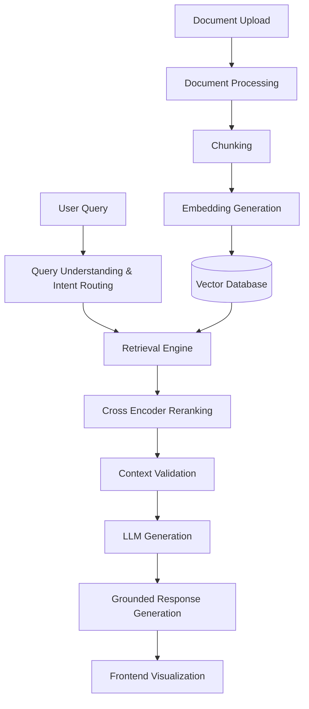

# IndusMind

An Agentic AI Platform for Industrial Knowledge & Decision Intelligence.

---

## Overview

IndusMind is an advanced Retrieval-Augmented Generation (RAG) platform designed specifically for the industrial and manufacturing sectors. It empowers engineers, technicians, and operators to rapidly investigate machine failures, comprehend complex manuals, and troubleshoot operational issues by intelligently retrieving information from technical documents, standard operating procedures (SOPs), and maintenance logs. By leveraging a multi-stage AI workflow, IndusMind bridges the gap between massive, unstructured industrial data and actionable decision intelligence.

---

## Problem Statement

Industrial facilities generate massive amounts of unstructured data, including dense equipment manuals, inspection reports, historical maintenance logs, and safety guidelines. When critical machinery fails or requires urgent maintenance, engineers often waste valuable time manually searching through thousands of pages of PDF documentation to find specific troubleshooting steps or safety protocols (e.g., Lockout/Tagout procedures). This delay increases downtime, compromises safety, and leads to significant financial losses. IndusMind solves this by providing instant, grounded, and highly relevant technical answers cited directly from the source material.

---

## Key Features

- **AI-powered document understanding**: Deep parsing and comprehension of industrial terminology and context.
- **Multi-document semantic search**: Execute parallel semantic queries across multiple documents simultaneously.
- **Agentic AI workflow**: Conceptual routing engine that adapts retrieval strategies based on query intent.
- **RAG pipeline**: A production-ready pipeline featuring query expansion, semantic caching, and context validation.
- **Source citations**: Verifiable page-level and chunk-level citations appended to every response.
- **Cross-Encoder reranking**: High-precision context reranking utilizing MS MARCO cross-encoders.
- **Knowledge & Context Graph**: Visual exploration of document relationships and context flow.
- **PDF upload and processing**: Native ingestion and chunking of complex PDF manuals.
- **Grounded responses**: Confidence scoring mechanism to ensure LLM responses are faithful to the retrieved context.

---

## System Architecture

The architecture is built on a highly modular, multi-stage retrieval and generation pipeline.



### Architecture Workflow

1. **Document Upload**: Users upload industrial PDFs via the React frontend.
2. **Document Processing**: The backend extracts text and structural elements from the PDFs.
3. **Chunking**: Text is split into semantically coherent overlapping chunks.
4. **Embedding Generation**: Chunks are transformed into dense vectors using BAAI/bge-base embeddings.
5. **Vector Database**: Embeddings and metadata are indexed in ChromaDB for low-latency similarity search.
6. **Retrieval**: User queries undergo intent classification and expansion before querying ChromaDB.
7. **Cross Encoder Reranking**: A cross-encoder model reranks the retrieved candidates for maximum relevance.
8. **LLM Generation**: Google Gemini generates a synthesized, grounded answer based strictly on the top chunks.
9. **Grounded Response Generation**: The response is scored for confidence and formatted with precise citations.
10. **Frontend Visualization**: Results, citations, and contextual graphs are presented in the interactive UI.

---

## Tech Stack

| Component | Technology |
|---|---|
| **Frontend** | React 18, Vite, Tailwind CSS, React Flow, Recharts |
| **Backend** | Python 3.x, FastAPI, Uvicorn, Pydantic |
| **LLM** | Google Gemini (gemini-2.5-flash / gemini-2.0-flash) |
| **Embedding Model** | BAAI/bge-base-en-v1.5 (Sentence-Transformers) |
| **Vector Database** | ChromaDB |
| **Reranker** | cross-encoder/ms-marco-MiniLM-L-12-v2 |
| **Document Processing** | PyMuPDF |
| **UI Components** | Radix UI, Lucide React, Framer Motion |

---

## Project Structure

```text
IndusMind/
├── backend/
│   ├── main.py
│   ├── config.py
│   ├── pipeline/
│   │   └── rag_pipeline.py
│   ├── routes/
│   └── services/
│       ├── retrieval_service.py
│       ├── llm_service.py
│       ├── reranker_service.py
│       └── query_understanding.py
├── frontend/
│   ├── package.json
│   ├── tailwind.config.ts
│   ├── index.html
│   └── src/
│       ├── components/
│       ├── pages/
│       └── hooks/
├── data/
│   └── chroma/
└── requirements.txt
```

---

## Installation

### 1. Clone the repository
```bash
git clone https://github.com/your-org/IndusMind.git
cd IndusMind
```

### 2. Backend Setup
Create a virtual environment and install the dependencies:
```bash
python -m venv .venv
# Windows
.venv\Scripts\activate
# Linux/Mac
source .venv/bin/activate

pip install -r requirements.txt
```

### 3. Frontend Setup
Navigate to the frontend directory and install Node dependencies:
```bash
cd frontend
npm install
```

### 4. Environment Variables
Create a `.env` file in the root directory and configure your keys (see Environment Variables section).

### 5. Run the Application
Start the FastAPI backend:
```bash
uvicorn backend.main:app --reload
```

Start the Vite frontend development server:
```bash
cd frontend
npm run dev
```

---

## Environment Variables

Create a `.env` file in the root directory of the project.

| Variable | Description |
|---|---|
| `GEMINI_API_KEY` | Your Google Gemini API key for response generation. |
| `OPENAI_API_KEY` | Optional OpenAI API key. |
| `CHROMA_DB_PATH` | Local directory for ChromaDB storage (default: `./data/chroma`). |

---

## Usage

1. **Upload documents**: Navigate to the upload section and drag-and-drop industrial PDF manuals or SOPs.
2. **Select documents**: Use the document selector to scope your queries to specific manuals or the entire knowledge base.
3. **Ask questions**: Enter technical queries (e.g., "What is the maintenance schedule for the hydraulic pump?").
4. **View citations**: Click on the inline citations to view the exact chunk and page number the LLM referenced.
5. **Visualize context**: Open the Context Graph view to see how entities and chunks relate to your question.
6. **Generate reports**: Use the reporting module to compile multiple insights into a comprehensive document.
7. **Export results**: Click the export button to download generated reports and session histories.

---

## Agentic AI Workflow

The IndusMind pipeline implements a multi-agent architectural concept managed by an intelligent Query Understanding Engine. Based on the user's intent, the engine routes tasks to specialized capabilities:

### Research Agent
Responsible for handling "Definition" and "Explanation" intents. It employs an exhaustive semantic retrieval strategy across multiple documents, expanding the user query to capture broad, conceptual knowledge about industrial machinery or processes.

### Maintenance Agent
Activated for "Troubleshooting" and "Procedure" queries. This agent specifically looks for step-by-step guides, diagnostic tables, and repair instructions. It structures the final LLM output into sequential, actionable maintenance steps.

### Sensor Agent
Designed to process "Analytical" and "Comparison" queries. It conducts cross-document retrieval and comparison, looking for threshold values, operating parameters, and specifications. It frequently formats the output into comparative markdown tables.

### Report Agent
Handles "Summarization" and "Recommendation" requests. It distills large volumes of retrieved inspection reports or safety guidelines into concise executive summaries or bulleted best practices.

---

## RAG Pipeline

The retrieval and generation pipeline is highly optimized for accuracy and relevance:

1. **Chunking**: Documents are split based on structural boundaries to maintain semantic integrity.
2. **Embeddings**: BAAI/bge-base-en-v1.5 embeddings generate high-quality dense vector representations of industrial text.
3. **Vector Search**: ChromaDB executes the initial semantic search to retrieve the top candidate chunks.
4. **Cross Encoder**: The MS MARCO cross-encoder evaluates the exact semantic relationship between the query and each candidate, discarding low-relevance chunks and promoting exact matches.
5. **Context Building**: The Context Constructor merges similar chunks, enforces token limits, and validates the presence of critical entities before generation.
6. **Grounded Generation**: The LLM synthesizes an answer using strictly the injected context. The output is validated against the retrieved chunks to assign a grounding confidence score (0-100), ensuring zero hallucination.

---

## Screenshots

### Home Screen


### Chat Interface


### Document Upload


### Knowledge Graph


### Context Graph


### Grounded Response


### AI Insights


---

## Performance

- **Low latency**: The pipeline utilizes semantic caching and optimized single-pass generation to deliver answers rapidly for repeated queries.
- **Semantic retrieval**: Fine-tuned intent classification ensures the most optimal search strategy (single vs. multi-query) is executed.
- **Cross Encoder reranking**: Ensures high precision by filtering out noisy semantic neighbors before they reach the LLM.
- **Grounded citations**: The system strictly ties every assertion to a source, minimizing AI hallucinations in technical responses.

---

## Future Improvements

- Integration with real-time IoT sensor telemetry data.
- Support for complex CAD drawing and schematic parsing.
- Advanced multi-modal LLM support to analyze equipment images alongside text.

---

## Contributing

We welcome contributions to IndusMind! Please follow these steps:
1. Fork the repository.
2. Create a new feature branch (`git checkout -b feature/amazing-feature`).
3. Commit your changes (`git commit -m 'Add amazing feature'`).
4. Push to the branch (`git push origin feature/amazing-feature`).
5. Open a Pull Request for review.

---

## License

This project is licensed under the MIT License. See the `LICENSE` file for details.

---

## Authors

**The IndusMind Engineering Team**
- Built with passion for industrial AI innovation.